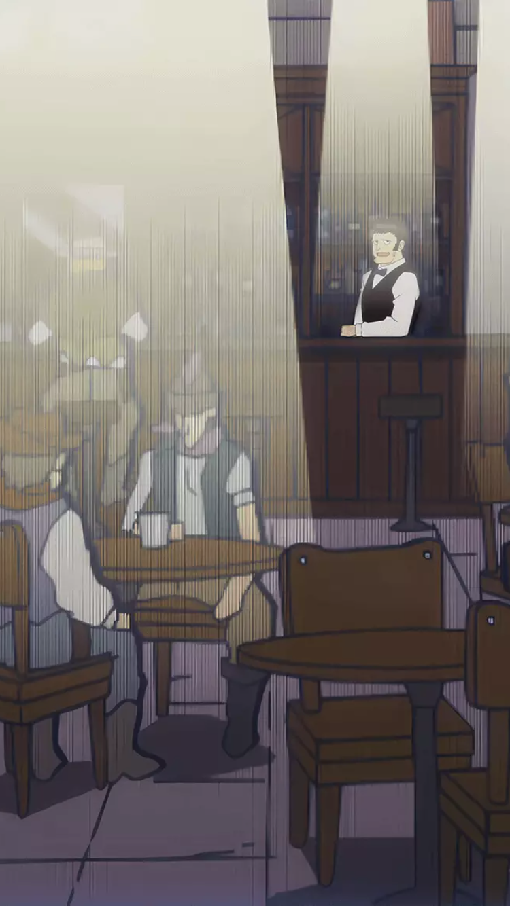
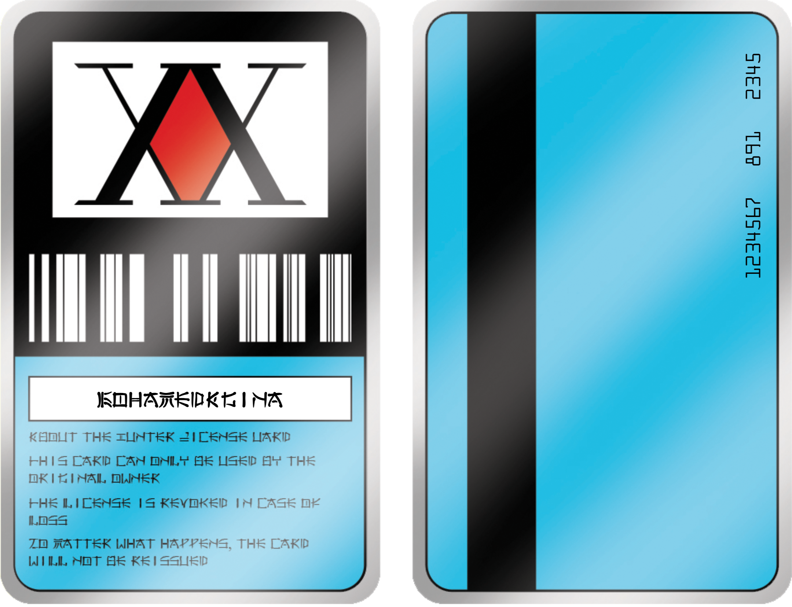
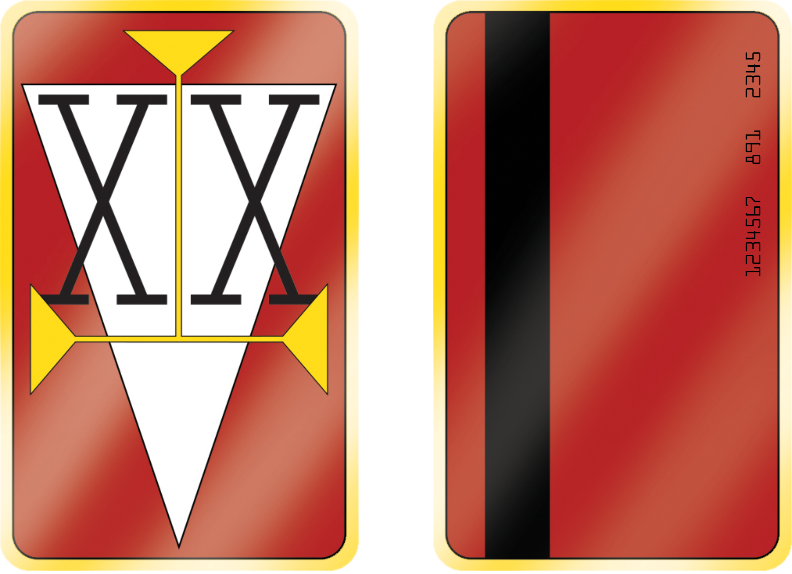

# Hunters Tavern (Hunter X Hunter)

This is an implementation of the hunter's tavern that appeared in hunter x hunter anime.

## Table of contents

- [Overview](#overview)
  - [The challenge](#the-challenge)
  - [Screenshot](#screenshot)
  - [Links](#links)
- [My process](#my-process)
  - [Built with](#built-with)
- [Author](#author)

## Overview

### The challenge

Users should be able to:

- View the optimal layout for the site depending on their device's screen size
- Enter his name and hunter's ID
- Interact with the barista
- Download a basic hunter license with his name and ID
- Download a two star hunter license with his ID

### Screenshot

### Links

- Live Site URL: [Hunters Tavern](https://hunters-site.vercel.app/)

## My process

### Built with

- Semantic HTML5 markup
- CSS custom properties
- Flexbox
- Grid
- [React](https://reactjs.org/) - JS library
- [HTML to Image](https://github.com/bubkoo/html-to-image) - JS library

## Author

- LinkedIn - [@mohamedagina](https://www.linkedin.com/in/mohamed-agina/)
